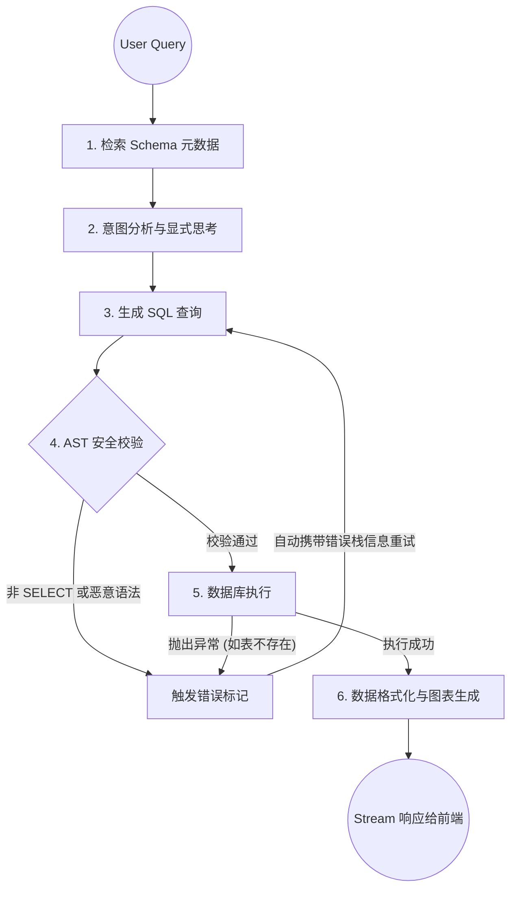

# KY Data Pilot Pro (ChatBI) — AI 驱动的数据库查询分析平台

> 🤖 生产级的企业 AI SQL 分析平台。通过自然语言对话，自动理解意图、生成 SQL、执行查询、并输出可视化数据分析报告。

## 📖 项目简介

KY Data Pilot Pro (原 ChatBI) 是一个专为企业数据环境打造的智能分析平台。用户只需通过自然语言提问（支持文本与语音输入），系统背后的 **LangGraph 状态机 Agent** 会自动完成数据库 Schema 检索、SQL 编写、安全性校验、数据执行以及最终的图表与总结生成。

本项目在架构上经过了严格的“防弹级”调校，彻底杜绝了 SQL 注入、前端白屏死机、状态污染等痛点，具备极高的工业级可用性。

---

## 🌟 核心能力与特色 (Key Features)

### 🛡️ 生产级的安全沙箱 (Enterprise-grade Security)
- **AST 级别拦截**：使用 `sqlglot` 对大模型生成的 SQL 进行抽象语法树级别的解析，强制拦截所有非 `SELECT` 语句（如 `DROP`, `UPDATE` 等）。
- **动态脱敏黑名单**：执行结果在返回前，强制过滤包含 `password`, `hash`, `token`, `secret`, `salt` 等敏感字段，防止数据泄露。
- **防 SQL 注入的元数据探索**：摒弃手写 `INFORMATION_SCHEMA`，全面采用跨库安全的 `SQLAlchemy Inspector` 获取表结构。
- **全量加密**：数据库密码和 LLM API Key 均采用非对称加密存储。

### 🧠 智能 Agent 架构与自愈机制 (Self-Healing Agent)
- **LangGraph 编排**：构建了多步状态图：`Schema 检索` → `显式思考` → `SQL 生成` → `安全验证` → `执行` → `报告生成`。
- **闭环自我纠错 (Self-Correction)**：当 SQL 语法错误或执行失败时，Agent 会通过 `messages` 历史获取底层报错详情，自动修正 SQL 并进入下一轮重试，全程无需人工干预。
- **多方言智能转译 (Transpile)**：通过 `sqlglot` 支持跨数据库方言的兼容，遇到小众方言解析失败时会自动降级转译。

### 🚀 高性能与容错前端体验 (Resilient UX)
- **Web Worker 零拷贝**：在浏览器后台线程处理音频的 `Float32` 到 `PCM 16k` 转换，彻底告别录音解析时的主线程卡顿。
- **分级错误边界 (Error Boundary)**：采用全局兜底 + 局部降级的策略，即使大模型生成了极其畸形的 ECharts 图表配置，也仅在局部显示友好的提示卡片，绝不影响整个对话流。
- **SSE 流控防抖**：对大段文本流的渲染引入了 `requestAnimationFrame`，配合长列表优化，保证滚动如丝般顺滑。

---

## 🏗️ 技术架构 (Tech Stack & Architecture)

### 1. 系统模块架构
```text
┌──────────────────────────────────────────────────────────────────┐
│                             Frontend                             │
│                   React 19 + TypeScript + Vite                   │
│   Zustand (持久化) + ECharts (可视化) + React Error Boundary     │
├──────────────────────────────────────────────────────────────────┤
│                             Backend                              │
│                       FastAPI + SQLAlchemy                       │
│    LangGraph (Agent 编排) + LangChain (LLM 适配) + sqlglot       │
├──────────────────────────────────────────────────────────────────┤
│                            Database                              │
│            MySQL/PostgreSQL (系统库) + 目标业务数据库            │
└──────────────────────────────────────────────────────────────────┘
```

### 2. LangGraph 状态机与工作流 (Agent Workflow)
系统后端核心基于 LangGraph 实现了一个具备**自愈能力**的有向图工作流：



---

## 🚀 快速开始 (Quick Start)

### 前置依赖
- **Python** >= 3.10
- **Node.js** >= 20.19 或 22.12+ (注意: 不支持 18.x)
- **关系型数据库** (用于存储系统配置，推荐 MySQL 8.0+ 或 PostgreSQL)

### 1. 数据库初始化
首次启动前，请在您的系统数据库中运行后端的 `database_init.sql` 脚本，以创建存储用户、配置、会话记录的基础表结构。

### 2. 环境变量与配置
在 `backend/` 目录下创建或修改您的环境变量（参考 `config.py`）：
- `DATABASE_URL`: 系统主数据库连接字符串。
- `CHECKPOINT_DATABASE_URL`: （可选）用于持久化 LangGraph Agent 状态的连接（PostgreSQL 推荐）。
- `DB_POOL_SIZE` & `DB_MAX_OVERFLOW`: 数据库连接池的性能参数（默认 5 和 10）。
- `ENCRYPTION_KEY`: 用于加密/解密用户凭证的对称密钥。

### 3. 启动应用
配置完成后，启动 FastAPI 后端和 Vite 前端服务。
登录 Web UI 后，**必须先在设置面板中配置 `LLM Config` 和 `Database Connection`**，然后才能开始对话。

---

## ⚠️ 开发与安全警告 (Security Warning)

> **权限最小化原则**：
> 尽管系统已在应用层利用 AST (`sqlglot`) 进行了严格的拦截，并强制附加 `LIMIT 100`。但在生产环境下，我们**强烈建议**您为配置在平台中的“目标业务数据库”提供**只读账号 (Read-Only User)**。应用层的安全机制绝不能完全替代数据库层的权限管控。

---

## 🗺️ 演进路线图 (Roadmap)

- [x] **AST 级 SQL 拦截**：防止非 `SELECT` 语句的执行。
- [x] **敏感字段过滤**：在 `execute_sql` 工具中加入字段级黑名单过滤。
- [x] **前端容错渲染**：引入 `ErrorBoundary` 防止图表解析失败导致的白屏。
- [x] **音频转码优化**：利用 Web Worker 解放主线程。
- [ ] **语音交互升级**：计划支持更低延迟、更稳定的 WebSocket 流式语音转文字（VAD 机制）。
- [ ] **RAG 知识库增强**：支持上传企业的内部数据字典 (Data Dictionary) PDF/Excel，增强 Agent 对复杂业务字段的理解能力。
